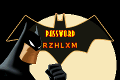

<div align="center">
  <a href="#">
      
  </a>

  <!-- project name -->
  <h1 align="center">Bat Password Generator</h1>
  
  <!-- project badges -->
  <p align="center">
    
  </p> 

  <!-- project description and menu -->
  <p align="center">
      An App to generate strong passwords.
    <br />
  </p>
</div>

<!-- ## Preview

<div align="center">
  <a href="#">
      
  </a>
</div> -->

## 🔥 Features
- [x] Generate a random Strong Password;
- [x] Copy Pass to Clipboard;

## Technologies

This project was developed with the following technologies:

-   [React Native](https://reactnative.dev/)
-   [Expo](https://docs.expo.dev/)


## Building

You'll need [Node.js](https://nodejs.org) installed on your computer in order to build this app.

```bash
git clone https://github.com/Jezebel1990/react-native-bat-pass-app.git
$ cd react-native-bat-pass-app
$ npm install
$ npm run start
```

## Usage

🔧 Run the script

```bash
$ npm run start
```

Runs the app in the development mode.<br/>

## Autor
Made with ♥ by [Jezebel Guedes](https://www.linkedin.com/in/jezebel-guedes/) 👋 Get in touch!
